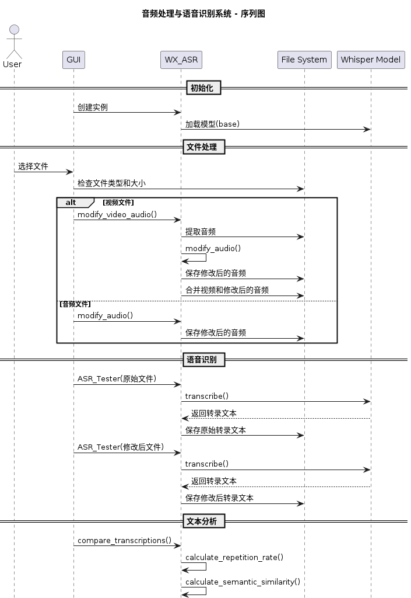

# 音频修改器 (WX_ASR)

这是一个用于音频处理的Python应用程序，可以为音频添加噪声并调整音量。该应用程序提供了图形用户界面（GUI）和命令行界面。

## 功能特点

- 音频文件噪声添加
- 音量调节
- 支持WAV格式音频文件
- 图形用户界面操作
- 语音识别测试功能（开发中）

## 系统流程图




## 安装要求

确保您的系统已安装Python 3.7或更高版本。安装所需依赖：

```bash
pip install -r requirements.txt
````

## 使用方法

### 图形界面使用

1. 运行主程序：

```bash
python main.py
```

2. 在图形界面中：
   - 点击"选择输入文件"按钮选择要处理的音频文件
   - 点击"选择输出文件"按钮选择保存位置
   - 点击"处理音频"按钮开始处理

   | 参数 | 默认值 | 说明 |
   |------|--------|------|
   | 噪声级别 | 0.005 | 控制添加噪声的强度 |
   | 音量增益 | 1.0 | 控制输出音频的音量 |


### 命令行使用

可以直接调用处理函数：

```python
from src.logic_component import WX_ASR

# 创建WX_ASR实例
wx_asr = WX_ASR()

# 处理音频文件
modified_audio, sr = WX_ASR.modify_audio(
    file_path="input.wav",
    output_path="output.wav",
    noise_level=0.003,
    volume_gain=1.2
)
```

### 📱 应用演示


## 参数说明

- `noise_level`: 噪声级别（默认：0.005）

  - 范围：0.0 到 0.1
  - 值越大，添加的噪声越明显

- `volume_gain`: 音量增益（默认：1.0）
  - 范围：0.1 到 5.0
  - 1.0 表示原始音量
  - 大于 1.0 增加音量
  - 小于 1.0 降低音量

## 目录结构

```
WX_ASR-Python/
├── main.py                 # 主程序（GUI界面）
├── requirements.txt        # 项目依赖
└── src/
    └── logic_component.py  # 核心处理逻辑
```

## Output 
```bash
=== 音频修改测试 ===
[√] 音频已修改并保存至: /Users/ctkqiang/Documents/上饶满星科技有限公司/WX_ASR-Python/media/output/modified_audio_20250216_170115.wav
[√] 采样率: 44100
[√] 修改后音频形状: (2610176,)

=== 语音识别测试 ===

转录原始音频:
[√] 转录文本已保存至: /Users/ctkqiang/Documents/上饶满星科技有限公司/WX_ASR-Python/media/transcribe/transcription.txt
[√] 原始音频转录结果: 女人越来越漂亮的四个好习惯做到一个就很了不起尤其是最后一个第一每天要喝 2000 毫升的水第二 减少糖分赦乳第三 坚持吃西红食第四 这也是 90%的女人都会忽略的一件大事不管是 40 岁、50 岁还是 60 岁皮肤差 没有光泽那真的是太险年纪了那么在这呢一个非常便宜的便美小方法 如果说现在脸色暗沉辣黄没有光泽黄七霜 别看他包装简单但是成分不玩虚的 致力随认主打去黄体量每天早晚去少量黄七霜均匀的吐末在脸上很多人都瞧不起他却不知道他是一个真真切切一个几十年的国产老牌子他呢 不做过度的营销只是靠着过硬的品质和口碑带带相传到现在

原始音频字幕重复率分析:
├─ 总字数: 9
├─ 重复字数: 0
└─ 重复率: 0.00%

转录修改后的音频:
[√] 转录文本已保存至: /Users/ctkqiang/Documents/上饶满星科技有限公司/WX_ASR-Python/media/transcribe/transcription.txt
[√] 修改后音频转录结果: 女人越来越漂亮的四个好习惯做到一个就很了不起尤其是最后一个第一每天要喝 2000 毫升的水第二 减少糖分射入第三 坚持吃西红食第四 这也是 90%的女人都会忽略的一件大事不管是 40 岁、50 岁还是 60 岁皮肤差 没有光泽那真的是太险年纪了那么在这呢一个非常便宜的便美小方法 如果说现在脸色暗沉辣黄没有光泽黄气霜 别看它包装简单但是成分不玩虚的 致力随认主打去黄体量每天早晚去少量黄气霜均匀的吐末在脸上很多人都瞧不起它却不知道它是一个真真切切一个几十年的国产老牌子它不做过度的营销只是靠着过硬的品质和口碑带带相传到现在

修改后音频字幕重复率分析:
├─ 总字数: 8
├─ 重复字数: 0
└─ 重复率: 0.00%

=== 文本比较分析报告 ===

【相似度分析】
├─ 相似度: 85.88%
├─ 相同字符: 219
└─ 总字符数: 255

【文本统计】
├─ 原始长度: 255
├─ 测试长度: 253
└─ 长度差异: 2

【文本内容】
├─ 原始文本: 女人越来越漂亮的四个好习惯做到一个就很了不起尤其是最后一个第一每天要喝 2000 毫升的水第二 减少糖分赦乳第三 坚持吃西红食第四 这也是 90%的女人都会忽略的一件大事不管是 40 岁、50 岁还是 60 岁皮肤差 没有光泽那真的是太险年纪了那么在这呢一个非常便宜的便美小方法 如果说现在脸色暗沉辣黄没有光泽黄七霜 别看他包装简单但是成分不玩虚的 致力随认主打去黄体量每天早晚去少量黄七霜均匀的吐末在脸上很多人都瞧不起他却不知道他是一个真真切切一个几十年的国产老牌子他呢 不做过度的营销只是靠着过硬的品质和口碑带带相传到现在
└─ 测试文本: 女人越来越漂亮的四个好习惯做到一个就很了不起尤其是最后一个第一每天要喝 2000 毫升的水第二 减少糖分射入第三 坚持吃西红食第四 这也是 90%的女人都会忽略的一件大事不管是 40 岁、50 岁还是 60 岁皮肤差 没有光泽那真的是太险年纪了那么在这呢一个非常便宜的便美小方法 如果说现在脸色暗沉辣黄没有光泽黄气霜 别看它包装简单但是成分不玩虚的 致力随认主打去黄体量每天早晚去少量黄气霜均匀的吐末在脸上很多人都瞧不起它却不知道它是一个真真切切一个几十年的国产老牌子它不做过度的营销只是靠着过硬的品质和口碑带带相传到现在

【重复率分析】
├─ 原始文本:
│ ├─ 重复率: 0.00%
│ ├─ 总字数: 9
│ └─ 重复字数: 0
└─ 测试文本:
├─ 重复率: 0.00%
├─ 总字数: 8
└─ 重复字数: 0

===================

=== 字幕重复率总结 ===
├─ 相似度: 85.88%
└─ 状态: ✓ 正常
=====================
```

## 注意事项

1. 确保输入音频文件格式正确（支持 WAV 格式）
2. 处理大文件时可能需要等待一段时间
3. 音量增益设置过高可能导致音频失真

## 错误处理

程序会对常见错误进行处理：

- 文件不存在
- 文件格式不支持
- 处理过程中的错误

错误信息会在 GUI 界面或控制台中显示。

## 开发计划

- [ ] 添加更多音频处理功能
- [ ] 支持更多音频格式
- [ ] 完善语音识别测试功能
- [ ] 批量处理功能
- [ ] 


## 🌟 开源项目赞助计划

### 用捐赠助力发展

感谢您使用本项目！您的支持是开源持续发展的核心动力。  
每一份捐赠都将直接用于：  
✅ 服务器与基础设施维护  
✅ 新功能开发与版本迭代  
✅ 文档优化与社区建设

点滴支持皆能汇聚成海，让我们共同打造更强大的开源工具！

---

### 🌐 全球捐赠通道

#### 国内用户

<div align="center" style="margin: 40px 0">

<div align="center">
<table>
<tr>
<td align="center" width="300">

<br />
<strong>🔵 支付宝</strong>
</td>
<td align="center" width="300">

<br />
<strong>🟢 微信支付</strong>
</td>
</tr>
</table>
</div>
</div>

#### 国际用户

<div align="center" style="margin: 40px 0">
  <a href="https://qr.alipay.com/fkx19369scgxdrkv8mxso92" target="_blank">
    
  </a>
  
  <a href="https://ko-fi.com/F1F5VCZJU" target="_blank">
    
  </a>
  
  <a href="https://www.paypal.com/paypalme/ctkqiang" target="_blank">
    
  </a>
  
  <a href="https://donate.stripe.com/00gg2nefu6TK1LqeUY" target="_blank">
    
  </a>
</div>

---

### 📌 开发者社交图谱

#### 技术交流

<div align="center" style="margin: 20px 0">
  <a href="https://github.com/ctkqiang" target="_blank">
    
  </a>
  
  <a href="https://stackoverflow.com/users/10758321/%e9%92%9f%e6%99%ba%e5%bc%ba" target="_blank">
    
  </a>
  
  <a href="https://www.linkedin.com/in/ctkqiang/" target="_blank">
    
  </a>
</div>

#### 社交互动

<div align="center" style="margin: 20px 0">
  <a href="https://www.instagram.com/ctkqiang" target="_blank">
    
  </a>
  
  <a href="https://twitch.tv/ctkqiang" target="_blank">
    
  </a>
  
  <a href="https://github.com/ctkqiang/ctkqiang/blob/main/assets/IMG_9245.JPG?raw=true" target="_blank">
    
  </a>
</div>

---

🙌 感谢您成为开源社区的重要一员！  
💬 捐赠后欢迎通过社交平台与我联系，您的名字将出现在项目致谢列表！

